My professional software engineer career began at Com2us Korea. From January 2023 to now, I worked as a **Proprietary Game Engine Programmer** which was developed by [Com2us Korea](https://com2us.com/). 

 {: width="400"}{: .align-center}

# **Proprietary Game Engine**

Our custom game engine is designed to push the boundaries of performance, efficiency, and flexibility for complex, large-scale projects. With a focus on optimizing core systems, we’ve integrated a variety of innovative features and tools, enabling rapid development cycles, better resource management, and enhanced player experiences.

{: width="400"}

# Responsibility

## Role in General

{: width="200"}

@ Real time Build System using Multi-Process : A feature similar to Unreal Engine’s Hot Reload, which reflects real-time changes made to the client user project without restarting the application
    

{: width="200"}

@ Image Compression System (DXT, ASTC, ETC2):
A robust image compression system that utilizes various compression techniques such as DXT, ASTC, and ETC2 to significantly reduce the size of textures while maintaining high visual quality. By leveraging specialized libraries like stb, astc, and etc2comp, the system optimizes texture storage and loading times, reducing the image size to as low as 1/8 of its original size.

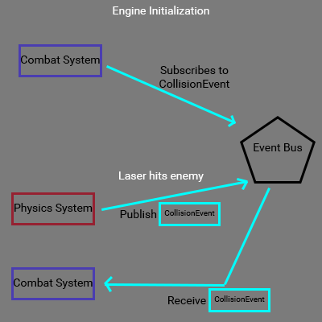{: width="200"}

@ Event System: A mechanism that allows developers to efficiently trigger predefined functions or behaviors in response to specific in-game events or conditions, enabling seamless communication between different systems within the game engine
    

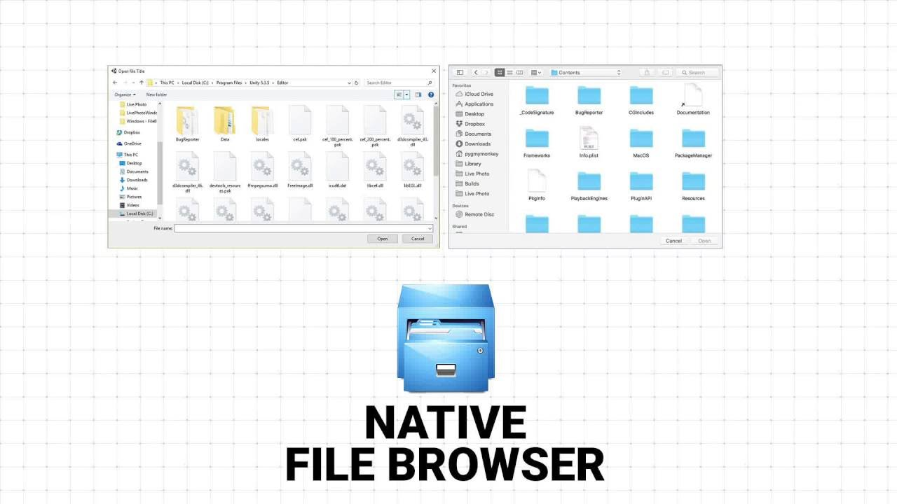{: width="200"}

@ Realtime Filewatcher System : A system designed to track real-time changes to files or assets, ensuring the game engine dynamically updates and reflects modifications without requiring a restart.
    

{: width="200"}

@ Audio System using Miniaudio Library:
A lightweight audio system integrated with the miniaudio library, providing efficient and high-quality audio playback across multiple platforms. It supports various audio formats and offers low-latency performance, enhancing the overall game experience.
    

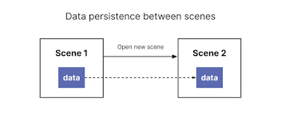{: width="200"}

@ Persistent Object System : A feature inspired by Unity’s DontDestroyOnLoad, designed to ensure specific objects or data persist across scene transitions or game states
    

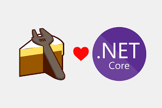{: width="200"}

@ C++ to C# Interoperability System: A framework enabling seamless invocation of functions from a C# project within a C++ project using the CoreCLR runtime.
    

{: width="200"}

@ C/C++ Runtime Reflection System: A system implemented using the Clang Compiler API to bring C#-like runtime reflection capabilities to C/C++. This enables dynamic access to and manipulation of program metadata, such as classes, functions, and properties, at runtime
    

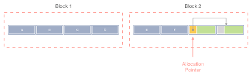{: width="200"}

@ Allocator System (Fixed Size, Variant Size, Red-Black Tree Combination):
A custom memory allocator combining fixed-size and variable-size allocation strategies with a Red-Black Tree structure for efficient memory management. This system reduces memory usage by 1.5 GB, optimizing memory allocation and deallocation processes to enhance performance and minimize fragmentation.
    

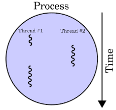{: width="200"}

@ Multithreading System: A robust framework designed to optimize performance and resource utilization in the game engine by leveraging multithreading techniques.

Example 1: Multi-threaded Updates with Job System: Implements a Job System to distribute tasks such as physics calculations, AI updates, or gameplay logic across multiple threads, ensuring efficient parallel execution and reduced frame times.

Example 2: Asynchronous Asset Loading: Utilizes background threads to load assets such as textures, models, and audio files asynchronously, preventing stalls in the main thread and ensuring smooth gameplay experiences.
    

{: width="200"}

@ C# to C++ Conversion Tool Using Roslyn API: A powerful tool that utilizes the Roslyn C# Compiler API to automate the conversion of Unity C# game source code to C++ code for use in your own game engine. This tool significantly accelerates the porting process by automatically translating key gameplay logic, systems, and scripts, reducing the development period by at least 2 weeks compared to manual code migration.
    

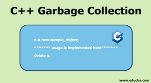{: width="200"}

@ Custom Garbage Collector with Safe Raw Pointer Handling: A custom garbage collection system developed with its own format, ensuring safe management of raw pointers. This system tracks memory allocations and deallocations in a way that prevents issues commonly associated with raw pointer usage, such as dangling pointers or memory leaks
    

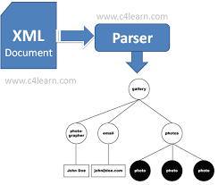{: width="200"}

@ Custom Parser and Serialization System: A tailored parser and serialization logic designed to handle multiple data formats such as JSON, YAML, MessagePack, and CMake. This system provides efficient and flexible serialization/deserialization of game data, ensuring compatibility with various external data structures and configuration files
    

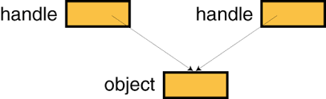{: width="200"}

@ Object Management System (Object Database and Object Handle): A robust system designed to manage game objects using an object database and object handles, with a focus on solving reference issues such as dangling pointers.
    

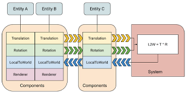{: width="200"}

@ Entity Component System (ECS): A highly efficient architecture for managing game entities and their components, designed to optimize performance and scalability.

Example 1: SparseSet: A memory-efficient data structure used to store and access entity-component associations. It minimizes memory overhead by providing fast lookups and handling sparse entity-component mappings without excessive memory usage, especially in large-scale games.

Example 2: Archetype: A system that organizes entities based on their component composition, allowing for efficient data access and iteration. By grouping entities with the same set of components into archetypes, this system enables cache-friendly access patterns, significantly improving performance for large numbers of entities with similar component types.
    

{: width="200"}

@ Prefab System:
A system designed to manage and instantiate reusable game objects or components, known as prefabs, within the game engine. It allows developers to define templates for complex objects that can be easily duplicated, modified, and reused across different scenes, ensuring consistency and reducing redundancy in object creation.
    

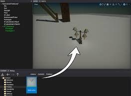{: width="200"}

Game Asset System:
A comprehensive system for managing, organizing, and optimizing game assets such as textures, models, sounds, animations, and scripts. It handles asset import, versioning, and dependencies, ensuring efficient loading and unloading of resources during gameplay. The system also supports multiple asset formats, provides tools for batch processing, and optimizes memory usage through asset bundling and compression techniques, enabling smoother performance and faster load times.
    

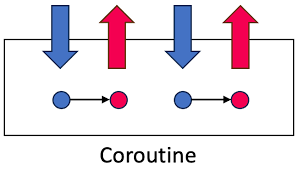{: width="200"}

@ Stack-based C++14 Coroutine System:
A coroutine system implemented in C++14, designed to efficiently manage asynchronous operations using a stack-based approach. By leveraging C++14’s coroutine features, it enables lightweight, non-blocking execution of tasks without the overhead of traditional thread management. This system allows functions to suspend and resume execution seamlessly, using minimal memory, while maintaining the flow of control. It is ideal for handling tasks such as event processing, parallel operations, and I/O-bound tasks, improving overall performance and responsiveness without relying on complex state machines or callback systems.
  

## Tech Stacks

Because of its long history, the MapleStory project consists of a wide tech stack, some of which is considered a technical debt nowadays. Here are some of those tech stacks publicly stated on their job descriptions looking for software engineers.

- **Visual C++** for the main programming language.
- **Win32** for underlying API
- **DirectX 9** for graphics API 
- **MSSQL** for DBMS
- **Python and C#** for in-house tools

You may not find the names of modern game engines like 'Unreal' or 'Unity' in the list. Instead of relying on commercial game engines, the founding fathers of MapleStory decided to construct the entire game structure from the ground up using C++ and supporting APIs, which was extremely common in the game industry at that time.

In this circumstance, I was among the C++ programmers who had extensively worked with the Win32-styled C++ codebase from earlier times. Even though the architecture was far from being 'modern', it provided me with insights into directly managing lower layers that grant programmers greater control over the hardware.

As the necessity for modernizing the C++ code arose, programmers were required to deeply understand modern C++. For me, this involved adopting the latest features, such as smart pointers for effective memory management, utilizing lambda expressions for expressiveness, implementing iterators to facilitate range-based for loops for a file accessor and modularizing repetitive utility functions with advanced template techniques such as SFINAE. Beyond coding, I actively contributed to shaping a robust coding convention, guiding the code to align with modern C++ standards.

I also made a substantial impact in the database domain. Holding an extensive user base, the database processed an extraordinary volume of requests simultaneously. Recognizing the necessity for efficiency, I engaged deeply in optimizing queries by taking in-house courses about query tuning. I sought knowledge about the overall data structure of a database along with associated concepts such as key, clustering, IO, and various join tactics. The outcome of this effort was a marked improvement in database performance, even in the face of intense real-time request loads.

## Tasks

### Fixing Bugs

A significant portion of the tasks I engaged in stemmed from legacies that composed the codebase. The most common duty was fixing bugs I discovered or reported by QA engineers and designers. The gameplay issues I handled covered every single component of the client and servers (note that the word *server* is pluralized, as multiple servers were taking distinct roles).

The general strategy to address issues began with scrutinizing them in a short time using the aforementioned *guess and verify* tactic. Then, I carefully revised the problematic code, taking caution to potential side effects that my code might introduce even with trivial modifications. I pushed the envelope to render my code as generic as possible so that other software engineers could understand my contribution and append their own seamlessly.

I have never discarded breakpoints placed during the debugging process; instead, I exported those breakpoints in the XML format through the Visual Studio Export Breakpoints feature, reusing them later to shorten the time taken to cope with similar issues. Moreover, I often shared them with teammates to boost the debugging process of the entire project.

### Dealing With Challenging Issues

Whenever I found myself to be having a tedious day, I used to encounter challenging issues that were extremely tricky to figure out their root causes, reproduce, or even figure out what was wrong with them. This kind of issue usually had one or more of these characteristics.

1. Concurrency issues (deadlock, race condition, ...)
2. Dependent on hardware or system
3. Lacking debug info
4. Non-reproducible

Server crashes usually satisfy the condition one and two. Servers are inherently multithreaded; one thread corresponds to a client. Multithreading allows the server to accept multiple requests simultaneously. This is evidently a huge leap over single-threaded applications, but it comes at a cost: concurrency issues.

Deadlocks were a very common issue on servers. Addressing deadlocks primarily involved analyzing crash dumps containing the context where the deadlock had occurred. I first identified which two threads had been holding the same resources with the [Visual Studio *Parallel Stack*](https://learn.microsoft.com/en-us/visualstudio/debugger/using-the-parallel-stacks-window?view=vs-2022). If they had been doing so in the reverse order, waiting for each other to release the other mutex, the deadlock was successfully identified. Subsequently, to resolve the deadlock, I rearranged the mutexes according to the priority of resources in the source code.

{: width="700"}{: .align-center} Viewing multiple threads in Visual Studio Parallel Stack
{: .text-center}

Race conditions were less evident than deadlocks. Actually, it was the very last case I would attribute to whenever I encountered a server crash, as finding clues was almost impossible. They were 'guessed' rather than 'detected' in situations where a single-threaded process would not end up. One instance of race condition was multiple threads' acquiring iterators to the same file. I doubted it as a race condition because where one of the pointers turned out to be nullified right after a null check. I ensured that this was a data race by successfully reproducing the crash of the overly parallelized file handling test. I amended the logic with additional mutexes, verifying that the race condition would not emerge again.

Given the worldwide service of MapleStory, it is not surprising that the project suffered text encoding issues. Texts encoded with [Multi-Byte Character Set (MBCS)](https://en.wikipedia.org/wiki/Variable-width_encoding) to support characters other than the ASCII set(especially Asian characters) often puzzled programmers as it required special treatments, unlike plane [ASCII](https://en.wikipedia.org/wiki/ASCII) strings. I dealt with an issue that arose from erroneously processing MBCS strings on a per-byte basis. The first rectification did not work, as the system encoding server was different from what I expected (case 2 - system-dependent!). After carefully experimenting with different setups, I was able to resolve the issue correctly.

For the purpose of sharing knowledge, I gave a detailed presentation about text encoding schemes in the project, as it was an unrecognized but significant topic. Teammates praised the section as *"dealing with an issue that has been neglected so far, but crucial for stable service"*.

### Crafting Gameplay Contents
The entire MapleStory project is updated with novel content periodically, most of which are seasonal events. One remarkable event out of many seasonal events I developed is **Bugcat Capoo Season 2** for TMS. 



First, I constructed an event dialog with sophisticated behaviors. It consisted of multiple widgets interacting with the event progress. Buttons were designed to enable itself only if the conditions for proceeding were satisfied. Then, the client side was associated with a backend-side logic. The logic stored the status of the quest in the database, handled requests from players, validated the requests to prevent abuse, and then managed daily progress and compensations.

Bugcat Capoo Season 2 employed a structural solution following the **Data-Driven Programming** pattern that I have explained in one of my articles in depth. The code I created executed fundamental operations and relied on external data to determine the actual flow. Instead of translating the design specifications written by cooperating designers, I offered them interfaces to modify the UI layout and adjust server-side parameters without consulting me. This not only gave designers more elaborate control over the conditions but also enhanced the productivity of software engineering with a succinct implementation.

### **Anti-Cheating**

MapleStory, being a massive globally-serviced game, always encountered cheating that would cause frequent headaches for the gaming community and developers. The cheating patterns were as diverse as the number of cheaters, but the root cause of naive validation in most cases. To save players from suffering losses caused by cheaters, the entire project members, including me, took extra care to eliminate abusive behaviors.

The No.1 principle I hold when programming the server-side logic is **"Never Trust What Clients Send"**, as cheaters could have manipulated the packets to make unfair profits. I consistently made an effort to thoroughly verify the authenticity of items sent by users, as the consequences of not double-checking packets were server crashes at least and disturbed in-game economy at worst.

The billing server underwent significant refactoring to eliminate potential cheating threats that could affect profits. I considered all scenarios where a cheater can abuse the purchase process to gain items at no cost. I eliminated such possibilities by establishing a crucial principle that opposes a renowned financial service (BNPL): *pay first, buy later*. By applying this rule, I ensured that items were granted only after the payment had been contracted in any scenario on the billing server. The renewal not only stabilized the billing server but also eventually contributed to promoting the sales of in-game cash items.  

Of course, anti-cheating measures cannot eliminate every single abuse. That is why a logging system is mandatory. At one point, the MapleStory project faced significant abuse issues related to missions. To distinguish cheaters from normal players, I investigated a pile of play logs for the detection of abnormal play patterns. The visualization of aggregated logs showed a clear division between the two groups, significantly contributing to penalizing cheaters.

### **Operations**

During my experience with the MapleStory team, my most exotic contribution was the development of an operation tool. It was a web-based application written in Javascript and C#, with which publishers could directly manipulate user data through an abstract interface. I added several features to help publishers manage the gaming service in a more straightforward way.

For AAA games, evaluating updates is as important as planning them. I used to write queries to extract players' content attending patterns to provide publishers and designers insight into players' preferences. Updates were often followed by user data loss that required direct data manipulation over the database to restore the original copy. Writing SQL commands to compensate for those losses was another duty of mine. 

# **Conclusion**

In the vast world of MapleStory, my responsibility involved all sorts of things that required me to learn the approach of a professional software engineer. The scale of service and the volume of the codebase were unprecedented throughout my lifetime. The experiences not only enriched my understanding of diverse tech stacks but also fortified my problem-solving skills and taught me the importance of operation.

Also, I had various technical experiences exclusive to the AAA project. Tackling rushing bugs was a big part of my daily routine, showing how committed I was to giving users a smooth experience. The server was heavily burdened, frequently facing deadlocks and race conditions due to a substantial player base's high volume of requests. I resolved the issue by counting only on limited debug info, which was challenging but worthwhile for expanding my horizon.

My role in the MapleStory project extended far beyond writing code; it encompassed a holistic commitment to the success of the large-scale service, significantly reducing the number of cheaters causing in-game chaos. I also figured out how crucial it is to log status and analyze things afterward to grasp how the service flows. I learned that the responsibility of a software engineer is not confined to expanding the codebase but stretches to ensuring the sustainability of the application in action.

The invaluable journey of expanding the project was a collective achievement, not accomplished solely by myself. Were it not for the help from talented colleagues, I would not have made it to meaningful milestones. Although it was not a long period, I feel fortunate to have worked as a software engineer for MapleStory at Nexon Korea. 
