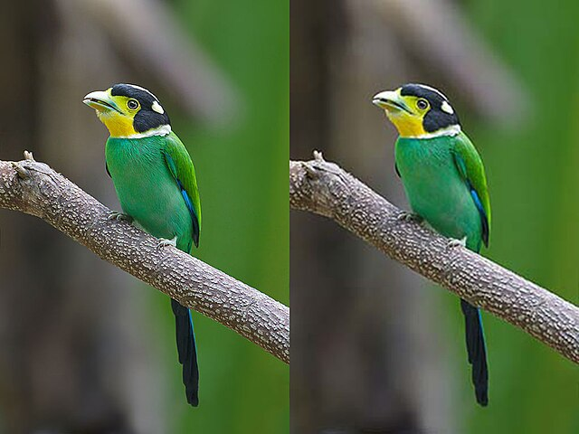

  
{: width="400"}

My professional software engineer career began at Com2us Korea. From January 2023 to now, I worked as a **Proprietary Game Engine Programmer** which was developed by [Com2us Korea](https://com2us.com/). 
  

{: width="400"}{: .align-center}

# **Proprietary Game Engine**

Our custom game engine is designed to push the boundaries of performance, efficiency, and flexibility for complex, large-scale projects. With a focus on optimizing core systems, we've integrated a variety of innovative features and tools, enabling rapid development cycles, better resource management, and enhanced player experiences. By adopting cutting-edge technologies like the Entity Component System, we've created a flexible and scalable architecture. Furthermore, our engine supports cross-platform development for Android, Mac, and desktop, utilizing a wide range of graphics APIs including Vulkan, OpenGL, and Metal.
  

# Responsibility

## Role in General

{: width="1200"}

@ **Real time Build System using Multi-Process** : A feature similar to Unreal Engine’s Hot Reload, which reflects real-time changes made to the client user project without restarting the application
    

{: width="400"}

@ **Image Compression System (DXT, ASTC, ETC2)** :
A robust image compression system that utilizes various compression techniques such as DXT, ASTC, and ETC2 to significantly reduce the size of textures while maintaining high visual quality. By leveraging specialized libraries like stb, astc, and etc2comp, the system optimizes texture storage and loading times, reducing the image size to as low as 1/8 of its original size.
    

{: width="400"}

@ **Event System** : A mechanism that allows developers to efficiently trigger predefined functions or behaviors in response to specific in-game events or conditions, enabling seamless communication between different systems within the game engine
    

{: width="500"}

@ **Realtime Filewatcher System** : A system designed to track real-time changes to files or assets, ensuring the game engine dynamically updates and reflects modifications without requiring a restart.
    

{: width="400"}

@ **Audio System using Miniaudio Library**:
A lightweight audio system integrated with the miniaudio library, providing efficient and high-quality audio playback across multiple platforms. It supports various audio formats and offers low-latency performance, enhancing the overall game experience.
    

{: width="400"}

@ **Persistent Object Syste**m : A feature inspired by Unity’s DontDestroyOnLoad, designed to ensure specific objects or data persist across scene transitions or game states
    

{: width="400"}

@ **C++ to C# Interoperability System**: A framework enabling seamless invocation of functions from a C# project within a C++ project using the CoreCLR runtime.
    

{: width="300"}

@ **C/C++ Runtime Reflection System**: A system implemented using the Clang Compiler API to bring C#-like runtime reflection capabilities to C/C++. This enables dynamic access to and manipulation of program metadata, such as classes, functions, and properties, at runtime
    

{: width="600"}

@ **Allocator System (Fixed Size, Variant Size, Red-Black Tree Combination)**:
A custom memory allocator combining fixed-size and variable-size allocation strategies with a Red-Black Tree structure for efficient memory management. This system reduces memory usage by 1.5 GB, optimizing memory allocation and deallocation processes to enhance performance and minimize fragmentation.
    

{: width="400"}

@ **Multithreading System**: A robust framework designed to optimize performance and resource utilization in the game engine by leveraging multithreading techniques.

Example 1: Multi-threaded Updates with Job System: Implements a Job System to distribute tasks such as physics calculations, AI updates, or gameplay logic across multiple threads, ensuring efficient parallel execution and reduced frame times.

Example 2: Asynchronous Asset Loading: Utilizes background threads to load assets such as textures, models, and audio files asynchronously, preventing stalls in the main thread and ensuring smooth gameplay experiences.
    

{: width="300"}

@ **C# to C++ Conversion Tool Using Roslyn API**: A powerful tool that utilizes the Roslyn C# Compiler API to automate the conversion of Unity C# game source code to C++ code for use in your own game engine. This tool significantly accelerates the porting process by automatically translating key gameplay logic, systems, and scripts, reducing the development period by at least 2 weeks compared to manual code migration.
    

{: width="400"}

@ **Custom Garbage Collector with Safe Raw Pointer Handling**: A custom garbage collection system developed with its own format, ensuring safe management of raw pointers. This system tracks memory allocations and deallocations in a way that prevents issues commonly associated with raw pointer usage, such as dangling pointers or memory leaks
    

{: width="400"}

@ **Custom Parser and Serialization System**: A tailored parser and serialization logic designed to handle multiple data formats such as JSON, YAML, MessagePack, and CMake. This system provides efficient and flexible serialization/deserialization of game data, ensuring compatibility with various external data structures and configuration files
    

{: width="400"}

@ **Object Management System (Object Database and Object Handle)**: A robust system designed to manage game objects using an object database and object handles, with a focus on solving reference issues such as dangling pointers.
    

{: width="400"}

@ **Entity Component System (ECS)**: A highly efficient architecture for managing game entities and their components, designed to optimize performance and scalability.

Example 1: **SparseSet**: A memory-efficient data structure used to store and access entity-component associations. It minimizes memory overhead by providing fast lookups and handling sparse entity-component mappings without excessive memory usage, especially in large-scale games.

Example 2: **Archetyp**e: A system that organizes entities based on their component composition, allowing for efficient data access and iteration. By grouping entities with the same set of components into archetypes, this system enables cache-friendly access patterns, significantly improving performance for large numbers of entities with similar component types.
    

{: width="400"}

@ **Prefab System**:
A system designed to manage and instantiate reusable game objects or components, known as prefabs, within the game engine. It allows developers to define templates for complex objects that can be easily duplicated, modified, and reused across different scenes, ensuring consistency and reducing redundancy in object creation.
    

{: width="400"}

@ **Game Asset System**:
A comprehensive system for managing, organizing, and optimizing game assets such as textures, models, sounds, animations, and scripts. It handles asset import, versioning, and dependencies, ensuring efficient loading and unloading of resources during gameplay. The system also supports multiple asset formats, provides tools for batch processing, and optimizes memory usage through asset bundling and compression techniques, enabling smoother performance and faster load times.
    

{: width="400"}

@ **Stack-based C++14 Coroutine System**:
A coroutine system implemented in C++14, designed to efficiently manage asynchronous operations using a stack-based approach. By leveraging C++14’s coroutine features, it enables lightweight, non-blocking execution of tasks without the overhead of traditional thread management. This system allows functions to suspend and resume execution seamlessly, using minimal memory, while maintaining the flow of control. It is ideal for handling tasks such as event processing, parallel operations, and I/O-bound tasks, improving overall performance and responsiveness without relying on complex state machines or callback systems.
  

## Tech Stacks

Here are some of those tech stacks publicly stated on their job descriptions looking for software engineers.

- **C/C++** for the main programming language.
- **Win32** for underlying API
- **OpenGL, Vulkan** for graphics API 
- **C#** for in-house tools

Our in-house engine team has embarked on a mission to create a highly optimized and lightweight modern game engine. Unlike relying on commercial engines like Unreal or Unity, our team is building the engine from the ground up to achieve unparalleled performance and flexibility.

Working with the 64-bit C++ codebase allowed me to develop a deep understanding of low-level programming concepts and implementations. Rather than merely tuning or improving existing features in modern engines, building everything from scratch provided me with a comprehensive grasp of low-level details and exposed me to cutting-edge technologies like Roslyn, Clang, SFINAE and ECS, enabling me to enhance my skillset.

